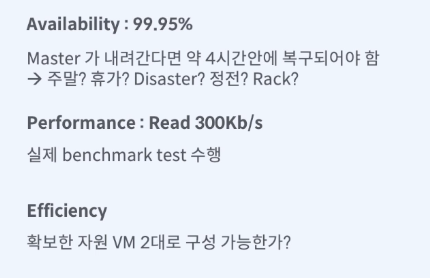

## 개념 :)
- Remote Dictionary Storage 의 약자로 'Redis' 라고 불리운다. 
- Redis 는 memory 기반의 data 저장소 이다.
  - 메모리에 데이터를 저장하다보니, 빠르다.
  - 단, 휘발성이다.
- Single Thread - CPU 를 하나만 사용한다.
- 초당 5 만에서 25만 Request 실행 가능하다.
- Key-Value 형식으로 데이터를 저장한다.

## 장점 : Read/Write 속도
- Hardware (I/O) 차이에서 오는 기본적인 performance gap 이 좀 있다.
- 다양한 Type 의 아키텍쳐를 지원한다. (Single, Master-Slave, Sentinel, Cluster)
- Partitioning
  - 데이터 저장시 여러노드에 분산되어 저장된다
- Popular
  - 인기가 많으니 지원하는 라이브러리가 다양하다.
  - 방대한 커뮤니티.

## 단점 : 휘발성
- AOF, RDB Snapshot 을 통해 Disk 에 저장하여 휘발성 문제를 해소
- Single Thread
- Memory Fragmentation
  - Fragmentation 이란 : 메모리에 썼다 지웠다 를 반복하다보면 실제로 데이터가 존재하지 않아도 해당 메모리에 데이터가 존재한다고 인식하는 경우, 혹은 그 반대인 경우도 있다.
    - 주기적으로 Fragmentation 을 지워주는것이 좋다.
- Big Size Data 에 적합하지 않다.
  - 휘발성 이라는 문제를 해소하기 위해서 Disk 에서 memory 에 있는 데이터를 읽거나, 변경된 부분에 대해서 Disk 에 쓰게 되는데.
  - 데이터가 너무 많이 들어가 있게 되면 Disk 에 쓰는 시간이 오래걸리게 된다
    - 오래 걸리면 Replication 이랑 Sync 가 안맞는 문제가 생길수도 있다.
    - 해당 요청으로 다른 요청이 대기를 하고 있는 상황이 벌어질 수 있다.
    - 디스크에 쓰는 양을 줄이기 위해서 다양한 옵션들을 설정하기도 하지만 기본적으로 너무 많은 데이터를 넣은 것은 (일반적으로) 적합하지 않다.

## 목적 : Cashing

> 자주 (사용되고, 반복되고) 빠르게 응답해야 되는것들 을 미리 준비해 두는것.

## 일반적 사용 : Session Store, List Data Caching
- List 형태의 데이터의 경우 일반 SQL 서버보다 약 10 배 이상의 성능을 낸다고 알려져있다.

## Redis 구조
Redis 는 크게 4가지의 구조로 볼 수 있다.

- Stand Alone (레디스 한대만 가지고 사용)
- Master-Replica (Master 와 read 용 Replica 를 두는 경우)
  - Master 에서 데이터가 변경이 되면 Replica 가 Master 와 데이터 차이를 확인후 똑같이 복사한다.
  - 구성하는것에 따라 Sentinel 과 비슷할 수 도 있다.
    - 앞단에 벨런서가 있다고 치고, heart Beat 을 감시해서 master 가 죽으면 스크립트를 실행해서 임의로 Replica 를 master 로 승격 시킬 수 있다.
      - 이게 자동화 된게 sentinel 이다.
- Sentinel
  - 모니터링 툴이다.
    - Master 가 죽으면 Replica 를 Master 로 승격시킨다.
    - Master 를 ( 사람이 ) 복구 하면 기존 Master 역할 하던 친구는 Replica 가 된다.
    - 보통 Master 와 Replica 는 서로 다른 존에 두는것이 좋다. ( 재난, 화재 등 ..)
- Cluster
  - 복수개의 Master 와 복수개의 Replica 가 있는 형태이다.
  - 기존 3 대 가 있어야 하고, Replica 가 따로 붙는 형태.
  - sentinel 이라는것을 따로 두지 않아도 장애상황시 자동으로 상호 보완 한다.
  - 샤딩한다.
    - 임의로 데이터를 나눈다.
    - 성능면으로 좀더 좋다

## 어떤 Redis 구조가 적절한가
- 사전에 정의한 품질 요건에 따라 다르다.

---
## 실습
