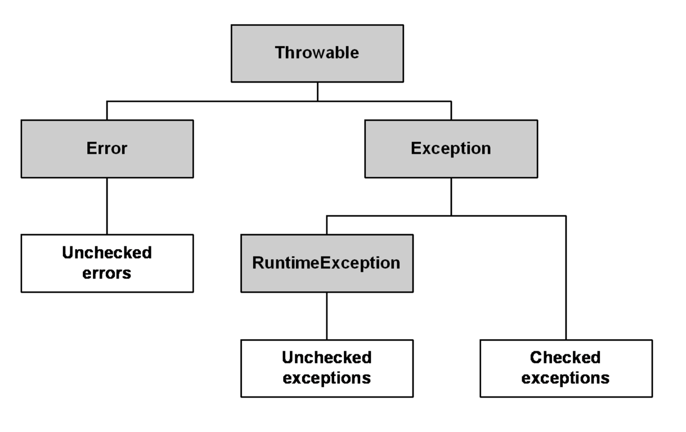
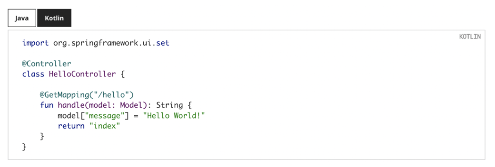

# 코들린의 현재와 미래
### 코틀린을 배워야하는 이유
- 코틀린은 IntelliJ로 유명한 젯브레인사에서 만든 언어이기 때문에 IntelliJ에서 자동완성, 자 바-코틀린 변환, 코루틴 등 코틀린 관련 편의 기능을 완벽하게 지원
- 자바는 발표된지 20년이 넘었지만 코틀린, C#, 스위프트와 같은 현대적 언어에 비해 기능 이 부족함
- 자바에서 Best-Practice로 불리는 기법들을 언어적 차원에서 기본 제공
- 자바에 비해 문법이 간결하기 때문에 가독성과 생산성이 높고 오류 가능성이 적어진다

```kotlin
data class Person(
        val name: String, 
        val age: Int, 
        val email: String
) // equals(), hashCode(), toString() 등 유용한 함수를 자동 생성

object MyCompany { // 싱글턴 객체 
    const val name: String = "MyCompany"
}

// 탑- 레벨 함수로 클래스 외부에서 함수 작성 가능
fun main() {
    // `new` 키워드 없이 객체 생성
    val person = Person("이상훈 ", 35, " digimon1740 @gmail.com ")
}
```

### 좀더 파해쳐 보자
- 문법 간결
- data class 라는 기능을 사용하게 되면
  - 자동으로 equals, hashcode, toString 을 자동으로 생성함
- object 라는 키워드를 사용하게되면
  - 간단하게 싱글턴 객체를 만들어준다.
- 함수를 탑 레벨에 위치
  - 탑 레벨 함수는 클래스 외부에서 함수를 작성할 수 있는 기능이다. ( 별도의 클래스 없이 작성가능 )
  - 반면 자바에서는 기본적으로 클래스를 만들고 그 안에서 메서드를 만든다.
- new 키워드 없이 객체를 만들 수 있다.
- 멀티 플랫폼 언어이다
  - 서버개발
  - e.g ) 모바일 앱, 프론트 js, 안드로이드

### 기업의 개선점
- google 의 경우 npe 를 33% 절감 함
- 그로인해 사용자 환경은 크게 향상 시켰다.

### 코틀린 타임라인
- 2016년 2월 코틀린 1.0 릴리즈
- 2017년 1월 스프링 프레임워크 5.0 부터 코틀린 공식 지원 발표
- 2017년 5월 구글 IO 에서 안드로이드 공식 지원 언어로 발표
- 2019년 5월 구글 IO 에서 안드로이드 개발시 최우선 언어 (Kotlin-First) 발표
- 2022년 5월 코틀린 1.7 베타 릴리즈
- ...

# 자바에는 있는데 코틀린엔 없는기능
### 체크드 익셉션(Checked Exception)
- 자바의 익셉션 계층
- Throwable : 예외 계층의 최상위 클래스
- Error : 시스템에 비정상적인 상황이 발생 예측이 어렵고 기본적으로 복구가 불가능 함
  - e.g) OutOfMemoryError, StackOverflowError, etc
- Exception : 시스템에서 포착 가능하여 etc (try-catch) 복구 가능
  - 예외 처리 강제 IOException, FileNotFoundException,
  - @Transactional 에서 해당 예외가 발생하면 기본적으론 롤백이 동작하지 않음
    - rollbackFor: 를 사용해야함
- RuntimeException
  - 런타임시에 발생하는 예외 예외 처리를 강제하지 않음
  - e.g ) NullPointerException, ArrayIndexOutOfBoundsException, etc



- java 에서 체크드 익셉션은 무조건 try catch 로 감싸줘야 하거나 throw 라는 키워드로 예외를 전파하지 않으면 컴파일 에러가 발생.
```java
try {
    Thread.slepp(1);
} catch (InterrupedException e) {
    // 예외처리    
}
```
- kotlin 에서는 체크드 익셉션을 강제 하지 않는다.
  - 그러나 원한다면 가능하다.
  - 자바에서 의미없는 체크드 exception 을 지양하는듯해.

### 기본 자료형
- 자바는 원시 자료형을 지원하며 객체로된 레퍼런스 타입도 지원한다.
```java
int i = 0;
Integer ii = 0;
String str = ii.toString();
```
- 코틀린은 레퍼런스 타입만 지원한다.
```kotlin
val i: Int = 0;
val str: String = i.toString();
```

- 코틀린의 레퍼런스 타입은 최적화된 방식으로 컴파일 한다.
```kotlin
int i = 0;
String str = String.valueOf(i);
```

--
### 정적멤버
- 자바는 static 키워드로 정적멤버를 선언한다.
```java
public class JavaClass {
    static int i = 0;
    
    public static void staticMethod() {
        // ...
    }
}
```
- 코틀린은 companion object 로 대체
```kotlin
class KotlinClass {
    companion object {
        val i: Int = 0;
        fun function() {
            // ...
        }
    }
}
```

### 3항 연산자
- 자바
```java
String animalSound = "호랑이".equals(animal) ? "어흥" : "야홍";
```
- 코틀린은 if else 로 대체한다.
```kotlin
val animalSound: String = if ("호랑이" == animal) "어흥" : "야홍";
```
--

### 세미콜론
- 자바는 무조건 ; 세미콜론이 붙지만 코틀린은 안붙는다.
```java
Boolean isAdmin = userService.isAdmin(userId);
```

```kotlin
val isAdmin: Boolean = userService.isAdmin(userId)
```

# 코틀린에는 있는데 자바에는 없는기능
### 확장
- 개발자가 임의로 객체의 함수나 프로퍼티를 확장해서 사용할 수 있다.

```kotlin
fun String.first(): Char {
    return this[0]
}

fun String.addFirst(char: Char): String {
    return char + this.substring(0)
}

fun main() {
    println("ABCD".first()) // 출력 A
    println("ABCD".addFirst('Z')) // 출력 ZABCD 
}
```

### 데이터 클래스
- 데이터를 보관하거나 전달하는 목적을 가진 불변 객체로 사용

```kotlin
data class Person(val name: String, val age: Int) {
    // hashCode(), equals(), toString() 자동생성됨
    // 이외에도 copy(), componentN 도 유용함.
}
```

- 기존 자바에선 주로 lombok 을 사용

```java
@Getter
public class Person {
    private final String name;
    private final int age;
}
```

```kotlin
// jdk 15 에선 record 라는 이름이 추가됨
public record Person(String name, int age) {
    
}
```
--

# 문자열 템플릿
- 문자열에 변수를 사용하거나 여러행으로 된 텍스트 블록을 사용 할 수 있다.
```kotlin
val text = "World"
val greeting = "Hello, ${text}"

println(greeting) // Hello, World

//  문자열 템플릿 기반의 다이나믹 쿼리
fun sql(nameIncluded: Boolean) =
        """
          SELECT id, name, email, age 
          FROM users 
          WHERE id = :id ${
                if (nameIncluded) {
                  """
                  AND name = :name
                  """ 
                } else ""
            }
        """
```

### 기타
- 스마트 캐스트 실드 클래스 (Jdk15 추가)
- 위임
- 중위 표현식
- 연산자 오버로딩
- 코루틴
- etc


# 공식문서
- https://docs.spring.io/spring-framework/reference/web/webmvc/mvc-servlet.html
- 공식 문서의 샘플 코드를 보면 kotlin 탭을 제공



# Spring initializr
- 기본 언어로 코틀린을 선택할 수 있고 코틀린인 경우 Gradle Project를 선택하면 빌드 설정 을 기반으로 생성해준다
- Spring initialzr 를 통해 생성된 build.gralde.kts

```gradle
import org.jetbrains.kotlin.gradle.tasks.KotlinCompile

plugins { 
    id("org.springframework.boot") version "2.6.7" 
    id("io.spring.dependency-management") version "1.0.11.RELEASE" 
    kotlin("jvm") version "1.6.21" 
    kotlin("plugin.spring") version "1.6.21"
}

group = "com.example"

version = "0.0.1-SNAPSHOT"

java.sourceCompatibility = JavaVersion.VERSION_11

repositories { 
    mavenCentral() 
}

dependencies { 
    implementation("org.springframework.boot:spring-boot-starter") 
    implementation("org.jetbrains.kotlin:kotlin-reflect") 
    implementation("org.jetbrains.kotlin:kotlin-stdlib-jdk8") 
    testImplementation("org.springframework.boot:spring-boot-starter-test") 
}

tasks.withType<KotlinCompile> { 
kotlinOptions { 
        freeCompilerArgs = listOf("-Xjsr305=strict") jvmTarget = "11" 
    } 
}

tasks.withType<Test> { 
    useJUnitPlatform() 
}
```


- 코틀린 스프링 프로젝트에서 필수적인 플러그인
  - kotlin("plugin.spring")

- 코틀린 스프링 프로젝트에서 필수적인 의존성
  - org.jetbrains.kotlin:kotlin-reflect
  - org.jetbrains.kotlin:kotlin-stdlib

이외에도 plugin.jpa, jackson-module-kotlin 등 프로젝트를 구성하면서 필요한 플러그인 과 <br/>
코틀린 의존성이 있고 Springinitialzr에서 프로젝트를 구성할 경우 자동으로 세팅해준다

# 스프링 부트
```
@SpringBootApplication class DemoApplication

// fun 탑- 레벨 함수이므로 클래스 바깥에서{ 호출
main(args: Array<String>) {
    runApplication<DemoApplication>(*args)
}
```

### @ConfigurationProperties
- 스프링 애플리케이션에 지정한 설정을 기반으로 설정 클래스를 만들때, <br/>
  @ConstructorBinding 을 사용하면 setter가 아닌 생성자를 통해 바인딩 하므로 <br/>
  불변 객체를 쉽게 생성할 수 있다.

```kotlin
@ConstructorBinding
@ConfigurationProperties("example.kotlin") 

data class KotlinExampleProperties(
                val name: String,
                val description: String,
                val myService: MyService
                ) {

data class MyService(
            val apiToken: String,
            val uri: URI
        )

}
```

### 테스트 지원
- 기본 제공되는 Junit5 기반의 테스트를 특별한 설정 없이 그대로 사용이 가능하다
- 모의 객체를 만들어 테스트하려면 Mockito 대신 MockK를 사용할 수 있다