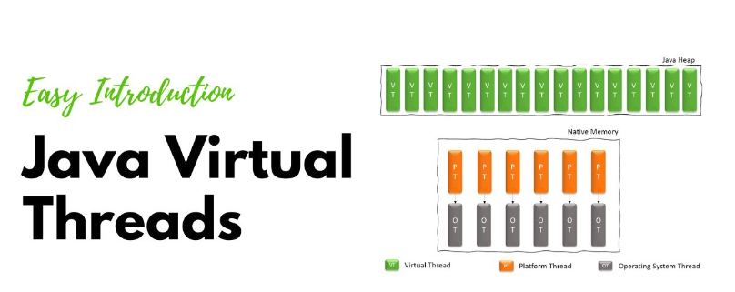
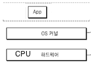
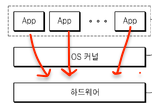
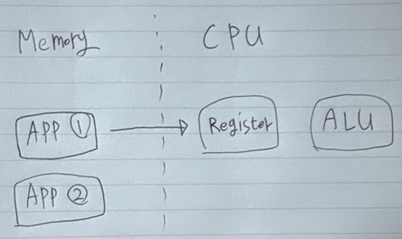
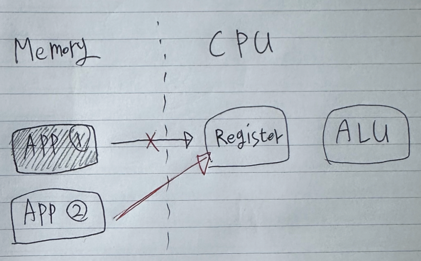
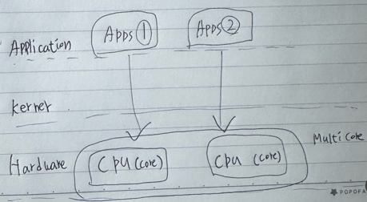

# 문득 java 21 이 등장하면서 virtual Thread 가 hot 한 지금..

### 한물 간다는 webFlux 를 공부하는게 맞을까 ...?
> 아니다... 왜 사라지는지 확실하게 짚고 넘어가는 게 맞다...

### cpu Bound 와 IO Bound 에 대해서 알아보자
- 단순 cpu 를 쓴다 라고 끝나는게 아니라, 다수의 데이터에 대한 집계 혹은 암호화 등 cpu 계산 능력에 따라 성능이 좌지우지 되는 능력을 말한다.

### 아래 그림을 보자

위 그림을 보면 `application 영역`, `커널 영역`, `하드웨어 영역` 을 계층화 하여 추상화로 나타낸 그림이다.   
여기서 동시간에 하나의 명령어를 처리할 수 있는 CPU core 가 한개 있다고 가정해보자  

application 은 실행되는 프로세스라고 보면 된다.  
이때 물리적인 cpu core 에 명령을 내린다고 가정해보자  

그리고 어플리케이션이 N 개가 더 추가되어 단일 CPU 코어 1 에 각각의 작업을 동작시켰다고 가정해보자.  

이떄 CPU 코어에서는 동시에 실행한 것처럼 보일수 있다  

> 그럼 동시에 `병렬` 로 처리한걸까 ? 

그렇지 않다. 동시간대 하나의 명령만 처리 할 수 있기 때문에, 타임 슬라이스를 아주 잘게 나눠서 잘라보면  
실제로 어플리케이션 1 번과 2 ... N 번이 번갈아 가면서 실행하게 된다.  

이렇게 번갈아 가면서 실행하는 과정을 OS 에서는 Context Switching 이라고 한다.
> 실행관점에서 문맥을 바꾸었다. 라는 의미다.

이러한 컨텍스트 스위칭 (ContextSwitching) 작업들은 CPU Bound 어플리케이션 에서 성능 저하를 가져오게 되는데  

그림으로 보면 아래와 같다.

어플리케이션이 실행되어 메모리에 로드되고 프로세스로 동작하게 될텐데.  
CPU 로 스케줄링 되어 실행될때, 기계어 실행을 위해 필요한 데이터들을 cpu Register 로 미리 가져오게 된다.  

그리고 ALU 를 통해 실제 계산을 진행하게 되는데 Register 에는 기존에 어떤 명령까지 진행했는지를 함께 저장 해 놓고  
필요에 의해 캐시를 해놓기 때문에, 동일한 프로세스의 일을 꾸준히 하면 할 수록 성능적으로 더 효과 적이다.

컨텍스트 스위칭은 위 그림과 같이 어플리케이션 2번을 실행시키기 위해 Register 정보를 초기화 하는 과정부터 시작한다.  
정확히는 어플리케이션 1 번이 실행했던 기존 실행 정보들을 메모리에 별도 저장 해 놓고, 2 번 어플리케이션 데이터 정보를 가져와서 다시 Register 적재를 한 뒤 명령어들을 실행하게 된다.  
하나의 CPU 에서 다수의 프로세스들이 번갈아 가면서 cpu 작업들을 진행해야 하기 때문에 성능상 오버헤드가 발생한다고 할 수 있다.  

### 그럼 여기서 문제...

위 어플리케이션 들을 어떻게 실행시키는게 가장 빠를까 
> 하나씩 순차적으로 실행하는게 가장 빠르다 ( 너무 당연한가 ? )  
> 컨텍스트 스위칭 이라는 오버헤드가 있기 때문  

### 어떻게 하면 CPU Bound 상황을 효과적으로 만질 수 있을까 ?

흔히 말할 수 있는 정략은 위와 같이 병렬 처리 되어야 효과적이다.  
동 시간대 각각의 명령어를 동 시간대에 처리할 수 있기 때문이다.  
